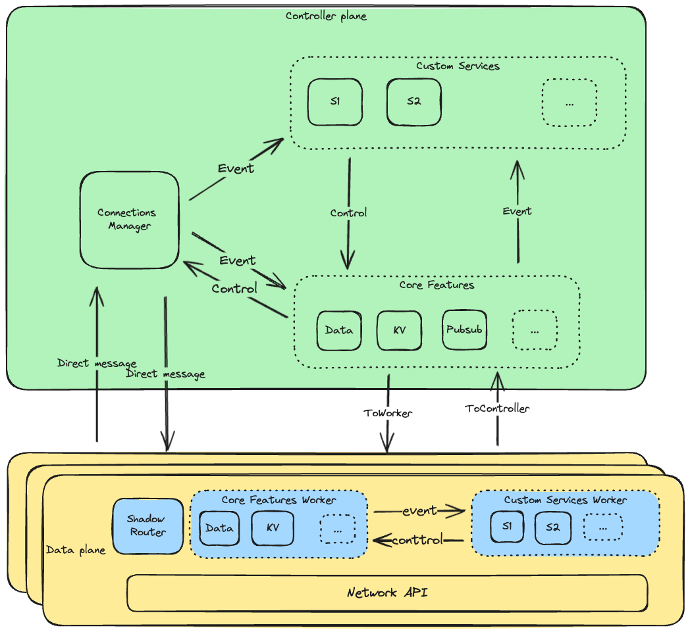
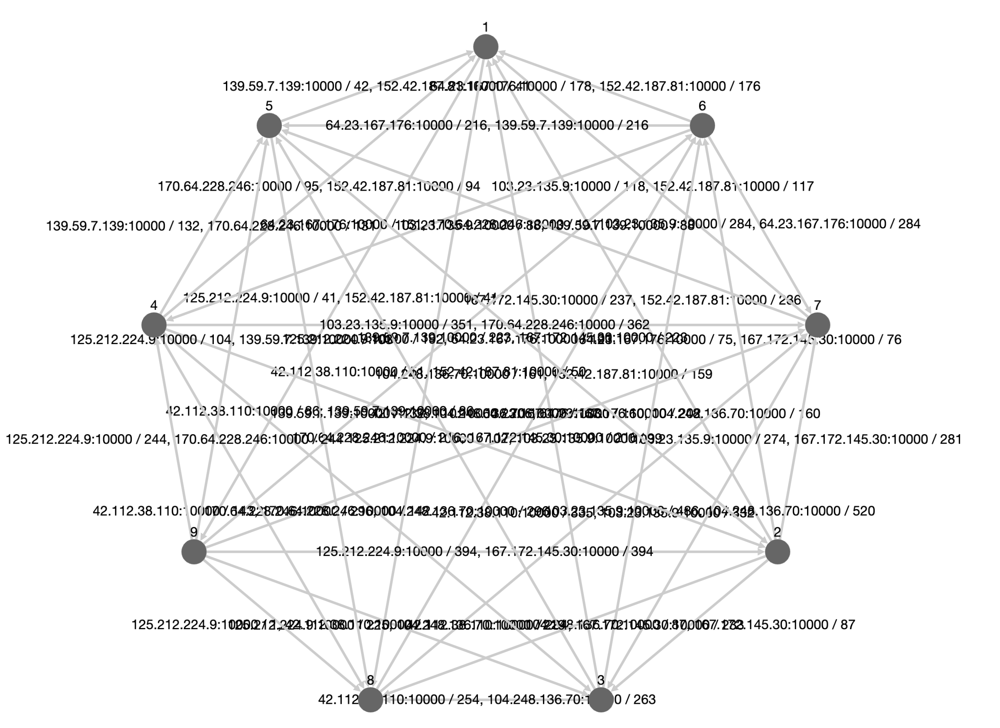

<p align="center">
 <a href="https://github.com/8xFF/atm0s-sdn/actions">
  
 </a>
 <a href="https://codecov.io/gh/8xff/atm0s-sdn">
  
 </a>
 <a href="https://app.codacy.com/gh/8xFF/atm0s-sdn/dashboard?utm_source=gh&utm_medium=referral&utm_content=&utm_campaign=Badge_grade">
  
 </a>
 <a href="https://deps.rs/repo/github/8xff/atm0s-sdn">
  
 </a>
<!--  <a href="https://crates.io/crates/8xff-sdn">
  
 </a> -->
<!--  <a href="https://docs.rs/8xff-sdn">
  
 </a> -->
 <a href="https://github.com/8xFF/atm0s-sdn/blob/master/LICENSE">
  
 </a>
 <a href="https://discord.gg/tJ6dxBRk">
  
 </a>
</p>

# atm0s-sdn: Global-scaled Ultra-low latency Decentralized SDN

A SAN I/O driven, open-source decentralized network infrastructure that can deliver high-quality data with minimal latency and efficient cost, similar to what Cloudflare achieves for their network.

For a deep dive into the technical aspects of network architecture, please refer to our [Smart-Routing](https://github.com/8xFF/atm0s-sdn/blob/master/docs/smart_routing.md)

## Features

- High availability by being fully distributed, with no central controller.
- Multi-zone support, high scalability.
- Metric based Adaptive routing: latency, bandwidth
- Network orchestration and discovery (manual mode only).
- High extendibility by using Network Service.
- Built-in features: PubSub, KeyValue ..
- Cross platform: Linux, MacOs.

### Build-in features

- [x] Router sync: automaticaly sync routing table between nodes for implementing Smart-Routing
- [x] Pubsub: Publish/Subscribe
- [x] DHT Multi-Map: Key-Value store
- [x] Node Alias: Each node can have multiple alias
- [x] Virtual Socket: Act as virtual UDP socket

### Build-in services

- [x] Visualization: show network structure
- [x] Manual discovery: each node can set owner tags and interested tags. each node will trying to connect to other nodes that have the interested tags.

## Architecture

We split logic in to 2 parts: feature and service.

- Feature: is a high-level logic that can be used to build a network service. For example, PubSub, KeyValue, Virtual Socket ..
- Service: is a extendable logic that can be used to build a custom logic. Each service can use all other features to build a custom logic.



For better in testing and developing we split library to 2 parts:

- Network Protocol: implement in SANS-I/O style
- Runner: for integrating with SANS-I/O runtime

## Getting started

Project includes some example and a standalone node, which can be used to test the network.

Build from source:

```bash
cd bin
cargo build --release
```

Running first seed node as a network structure collector:

```bash
cargo run -- --collector --local-tags demo --connect-tags demo --node-id 1 --udp-port 10001 --web-addr 0.0.0.0:3000
```

Running second nodes and join to network with seed node (you need to replace with seed node IP if it running on another device):

```bash
cargo run -- --local-tags demo --connect-tags mode --seeds 1@/ip4/127.0.0.1/udp/10001 --node-id 2 --udp-port 10002
```

Same with this, we can run more nodes and connect to the network. Remember change node-id and port for not conflict with other nodes.

Access to the web interface to see the network structure: [http://localhost:3000](http://localhost:3000)



You can also enable vpn feature in each node by add `--vpn` flag. After that, each node will be assigned with a private with rule: `10.33.33.{node_id % 8}`.

## Benchmarks

### Network optimizer

We run 9 nodes accross Asia, Us, Europe with Digital Ocean and some local ISP in Vietnam and test the latency between each node. The result show that the network can speed up latency by maximum 48.5% compare to normal routing.

Maximun optimized:

|      | US    | EU     | ASIA |
| ---- | ----- | ------ | ---- |
| US   | 0     |        |      |
| EU   | 3.40% | 0      |      |
| ASIA | 48.5% | 28.30% | 47%  |

Average optimized:

|      | US    | EU    | ASIA |
| ---- | ----- | ----- | ---- |
| US   | 0     |       |      |
| EU   | 0.40% | 0     |      |
| ASIA | 11.6% | 9.50% | 3%   |

We will test more in the future to get more accurate result with more cloud provider and local ISP.

### Speeds

## Showcases

- Decentralized Media Server: [Repo](https://github.com/8xFF/atm0s-media-server)
- Decentralized VPN: [Repo](https://github.com/8xFF/atm0s-sdn/tree/master/bin/)
- Decentralized Reverse Proxy: [Repo](https://github.com/8xFF/atm0s-reverse-proxy)

## Contributing

The project is continuously being improved and updated. We are always looking for ways to make it better, whether that's through optimizing performance, adding new features, or fixing bugs. We welcome contributions from the community and are always looking for new ideas and suggestions. If you find it interesting or believe it could be helpful, we welcome your contributions to the codebase or consider starring the repository to show your support and motivate our team!

For more information, you can join our [Discord channel](https://discord.gg/qXr5zxsJWp)

## Roadmap

The first version will be released together with [Media Server](https://github.com/8xFF/decentralized-media-server) at the end of 2023.

Details on our roadmap can be seen [TBA]().

## License

This project is licensed under the MIT License - see the [LICENSE](LICENSE) file for details.

## Acknowledgments

We would like to thank all the contributors who have helped in making this project successful.
