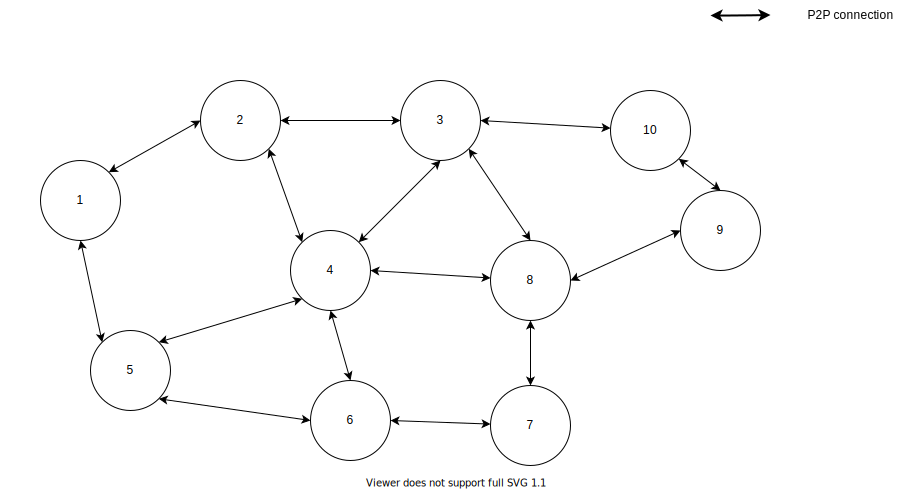
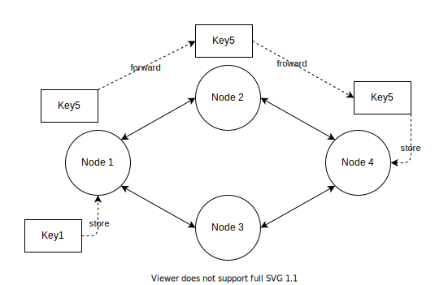
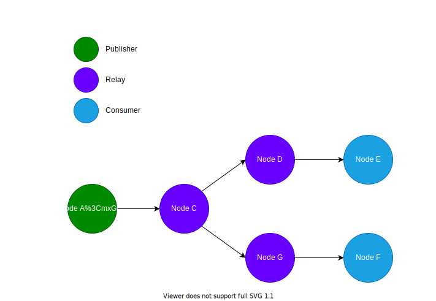
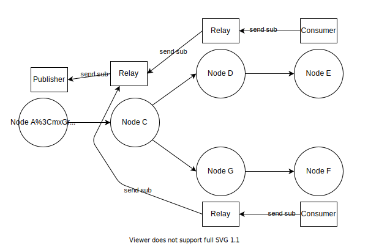

# Decentralized SDN Architecture

## 1 Overlay network 

8xFF decentralized network supports a wide range of devices, from high-end servers to slow embedded devices. As high-end servers always have public-IP, it is easy to create P2P connection between any nodes. In contrast, slow embedded devices are always in a NAT network; therefore, we need to also support these devices in NAT. 

With the above conditions, the direct connection between each nodes sometime cannot be established, therefore the network will allow data is relayed over other node if needed.



### 1.1 Addressing 

Short node_id should be used for identification in the 8xFF network to minimize routing table size. Therefore, we choose 32-bit node_id with the following format:

`[Geo1 1byte][Geo2 1byte][Group 1byte][Index 1byte]`

With 

- Geo1: Geographic location ID 
- Geo2: Sub Geographic location ID, Geo1 and Geo2 are combined to determine where a node is located. Geo1 and Geo2 also make it easier for routing between nodes like between country & city 
- Group: Group ID in a GeoZone 
- Index: Index of Node in a Group 

Moreover, in order to extend to devices without internet connection such as IoT devices like ZigBee or BLE..., each node can have one or multiple addresses with which other nodes can set up connection. For example: 

- tcp://5.5.5.5:6666 
- quic://6.6.6.6:8888 
- stun+udp://232323@6.6.6.6:8888 
- zigbee://2323232@9.9.9.9:3333 

#### 1.2 Network coordinator: Satellites 

Satellites are super nodes responsible for network coordination, core services, routing... Therefore, satellites are grouped into a special zone with GeoZone1, GeoZone2 and Group ID of 0. 8xFF network has a maximum of 256 Satellites 

Satellites have the following main roles: 

- Network Coordination 
- Core Services Running 
- Node registry 

#### 1.2.1 Network Join 

When a node wants to connect to 8xFF network, it needs to be assigned with a unique NodeId with correct node location.

#### 1.2.2 Network connections coordinate 

After receiving NodeId and other correspondent information, node will periodically request a list of neighbouring nodes to connect or disconnect from a random Satellite.  

The simplest way to do this is using a method of Chord to build finger table, in which each node creates a maximum of 32 outgoing connections with other nodes. 

### 1.3 Simple group routing

For simple routing between nodes, we will investigate a simple network of nodes with id from 0 to 255. Each node has some connection as described above. With this condition, we can always find a path between each two nodes. 

In order to find the best route based on a set of predefined conditions (cost, speed...), each node has to maintain a routing table to other nodes as below: 

| Dest | Over | Best Metric |
|------|------|-------------|
|   D  |   B  |  Rtt(10), Cost(10), 20Mbps |
|   D  |   C  |  Rtt(11), Cost(9), 10Mbps  |


With this routing table, each node can always find good paths to all other nodes in the group.

In order to build this routing tables, each node has to periodically send a Routing Sync message to its connected neighbors in the following logic: 

- Node A sends RoutingSync to its neighbour - node B - with all the best paths to all destinations not through node B 
- Node B using RoutingSync from A for update its own’s routing table by adding or removing destinations that they can send data over through node A 

With the above table, RoutingSync for node B from node A is: 

| Dest | Best Metric |
| ---- | ----------- |
|  D   | Rtt (11), Cost (9), 10Mbps |

 
Will Routing table in each node, we can choose routing path corresponding routing condition like: (Rtt < 100ms, Cost < 10, Bandwidth < 10000Kbps). With nodes having routing tables as above, whenever a specific node wants to find the route to a destination, it would use RoutingTable to find the next node. This action would be repeated until it reaches the destination, or fail if ttl exceeds a certain threshold (for example 10 hops or max cost) 

### 1.4 Cross zone routing 

As described above, we can route inside any group with some routing conditions, and in this section, we describe how to route between groups.

#### 1.4.1 Routing tables 

Each node has 4 routing tables with 255 destinations, or 4 layers in NodeID 

- Layer1: Geo1 Table 
- Layer2: Geo2 Table 
- Layer3: Inner Geo Group Table 
- Layer4: Inner Group Index Table 

Layer1 is the bigger geo-location of node (country), Layer2 is more specific than Layer1 (city in the country). For simplicity, Layer1 and Layer2 can be generated from Latitude and Longitude 

With this method, a node needs to maintain only 1024 destinations, which will reduce the outgoing Sync message size to the maximum of 1020 slots. 

#### 1.4.2 Routing logic 

When node A wants to send a package to node B, it will check whether it and node B have any mutual layers. Based on this information, it could decide which layer table to use for routing in each layer. 

For example: 
- A (1,1,1,2) to B (1,1,1,3): A and B are in the same Geo and same Inner Geo Group, therefore node A only needs to be used Layer4 routing table.
- A (1,1,1,2) to C (1,2,1,3): A and B in the same Geo1, therefore node A needs to use Layer2 routing table to determine the next hop. 

Each layer has 256 IDs, while the number of connections in each node is 8; as a result, the number of hops required in each layer is `log(256)/log (8) = 2.667` hops in average. With cross-zone routing, with 4 layers, we will have the route between any two nodes is about 2.667 ~ 10.667 hops. 

#### 1.4.3 Optimize routing path 

With routing tables as above, we can find good enough routes between any two nodes, but these routes are not always the best ones. Therefore, we can apply strategies like AStar algorithm to find route to any randome node: 

- Each node stores a limited list of destinations and best routes 
- If the current node is the destination, send a success response to the requesting node 
- If the current route exceeds predefined conditions (hops, cost...), send a failure response to the requesting node 
- If the current node is not the destination, choose the 2 best routes based on stored information in the routing table and forward the request to these 2 nodes; then wait for responses from them and find the best possible route, save the information as a list of routes and send back to the previous node. 

AStar algorithm can help us find another best path that matches complex routing conditions. 

## 2 DHT 

DHT is one of the most important parts of the overlay network. It supports app development by providing key-value data queries such as the info of each stream or each user. In the 8xFF network, DHT is similar to Kademlia in the way it stores keys at the closest node by XOR.

```
Distance(A,B) = A XOR B
```

With the distance formula above, the Set or Get command to the correct node can be fulfilled simply with the following steps: 

1. Split key to 4 layers L1, L2, L3 and L4 (similar to the layers in the node Address part) 
2. Name the closest Slot to the Ln is C(Ln, n) in the layer n of routing table 
3. Start with L1, if C(Ln, n) = Ln and n < 4 then repeat step 3 with the next layer  
4. If step 3 ends with n = 4, the key will be stored in the current node; if not, the command will be forward to the best node in slot C(Ln, n) 

For example, in the chart below, Node1 will itself take care of storing Key1. With Key5, Node1 will forward to Node2 and then to Node4 and will be saved at Node4.



Moreover, to be sure, we can replicate each key with a copy in another node. This is simply done by generating a replicate key of a Key, then sending each Get or Set command using both keys. After the key is stored, periodically nodes will try to synchronize all their stored keys with the 2 nodes responsible for the key. The replication ensures whenever a node is offline or online, the affected keys will sync to the correct nodes. The replicate key is generated by this simple formula: 

```
ReplicateKey =  OriginKey XOR ReplicateFactor
with 32 bit keyspace ReplicateFactor 0x80808080 is chosen
```

Based on the Xor formula characteristics, we have: 

```
ReplicateKey XOR ReplicateFactor =  OriginKey XOR ReplicateFactor XOR ReplicateFactor = OriginKey 
```

This ensures that the original and replicating version are stored correctly in both Set or Sync steps.

## 3 Pub/Sub 

The pubsub system has two main roles with each channel X: 

- Publisher(X): node that generates data for the channel X 
- Consumer(X): node that requests data from the channel X 

In order to be compatible to streaming applications, 8xFF pubsub system has to meet the two following criteria: 

- Fast: Publisher needs to send to Consumer as fast as possible to reduce end-to-end latency 
- Effective: Occasionally, there may be a lot of Consumers requesting to subscribe to the same channel; therefore, it is necessary to save the bandwidth used to send data among Publisher and Consumers 

Firstly, in the pubsub system, each piece of data belongs to only one channel and is identified by a unique channel ID. Each Consumer who requests data from a channel needs to know the channel’s identity and the Publisher’s node_id. With these two criteria, the Consumer can send a subscribe request to the Publisher through the fastest route, vice versa. For Consumes to know the ID of Publisher, we use a table as described in the previous section about DHT with:  

| Key | Value |
| --- | ----- |
| Channel's identity | Publisher's node_id 

However, in some situations, Consumer may start subscribing before the Publisher publish a channel. To solve this problem, the Consumer node has to subscribe to a channel and to the DHT key at the same time. In that case, whenever there are any changes to the DHT key, the Consumer will be notified. 

Next, to optimize bandwidth, we can use some Relay nodes. For example, if we have a one-channel pubsub network with following structure: 

- A is a publisher and E, F are 2 consumers 
- A to E fastest path: A -> C -> D -> E 
- A to F fastest path: A -> C -> G -> F 



Then, each node C, D and G plays as a Relay for the channel. As a result:

- A only sends data to C once 
- C only sends data to D and G 
- D only sends data to E once 
- G only sends data to F once 


The above method can reduce bandwidth for node A because it has to send only once instead of twice when E and F request to subscribe to A directly. This can be implemented by a simple algorithm, for example, when node E requests to subscribe to channel X in node A: 

- Node E uses its routing table to select the next neighbor node N with fastest route to A, then sends Subscribe(X, A) to N 
- Node N receives Subscribe(X, A) and: 
    - If it isn’t A and it doesn’t have Relay(X, A), it will create Relay(X, A) and send Subscribe(X, A) to the next neighbor node in the fastest route to A 
    - It then adds the sender to consumers list of Relay(X, A) or Publisher(X, A) 
- This step is looped until node A receives Subscribe(X, A) or fails to find the fastest route to A 



With the above approach, the pubsub system in 8xFF can achieve ultra-low-latency while saving bandwidth effectively. On the other hand, it can also resolve the scaling problem: with each channel, each relay node has to send data only to as many nodes as those directly connected with it.

## 4 Unstable network adaptive 

In a decentralized network, nodes' capacity and quality are diversified. There are risks of failure anytime, in which node can suddenly be offline or network gets interruption. Therefore, it is necessary to maintain a stable network whenever having troubles with some nodes. 

In detail, when a node has problems, the node "next-to" can immediately recognize the issue via Connection events such as Disconnected or Bandwidth Estimation Changed. The information will be updated on the Routing Table of all the nodes "next-to" then will be spread to all the related nodes through the Routing table synchronization (described in Overlay Network section). This process will be completed after a few synchronization cycles. 

In case of Multicast/Pubsub, there is a faster solution to get adaptive route, as follows: 
- When a Relay detects any problems with its data source (disconnection or low speed), it will fall back to all Consumers. 
- Consumers will re-subscribe so that system can find a better path.  

## 5 Scalable Streaming with Pub/Sub 

This section will show the way to apply 8xFF Overlay Network in Streaming application. In any Streaming application, it is able to split data into some separated channels, for example audio channel and video channel:

- user1/video: User1’s video 
- user2/video: User2’s video 
- user1/audio: User1’s audio 
- user2/audio: User2’s audio 
- user1/screen: User1’s screen 

A Pubsub channel is used as a media transfer tool. By that way, each media source publishes data to a channel id, which is generated by the Hash of the Channel's name. Then consumers can easily get the expected data by subscribing to that Channel. The map between pubsub and media streaming is described in the table below: 

| Streaming | Pubsub |
| --------- | ------ |
| Media Stream | Channel |
| Media Source | Publisher |
| Media Viewer | Consumer |

This solution resolves all the following challenges of streaming: 

- Scalability: Each media stream has only one source but thousands or millions of viewers. 8xFF can serve unlimited number of viewers through distributing viewers into different servers by geography. 
- Global coverage: User is connected to the closest server and data among servers is transferred through a high-speed and stable relay network. By that way, the quality of streaming is guaranteed for users wherever they are.
- High quality: The transferring route is the most productive one cause it is selected by comparing it to hundreds of options, even better than the direct route to the data source server. This can be easily proven, especially when there is network congestion or undersea internet cable disruptions.

As proved, thanks to the Pubsub system, we can build a streaming application that match all critical requirements: Scale, Global Coverage and Quality. 
